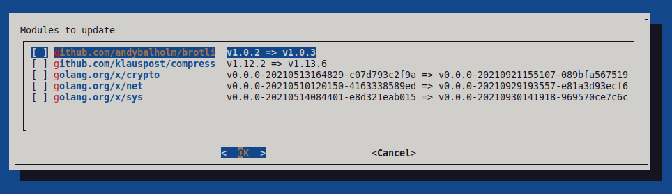

# Go mod update tool

Go modules interactive update tool. By default, you need to execute many commands
consecutive to perform the update:

```shell
# for force update of all outdated modules
while IFS= read -r mod; do go get $mod; done <<< `go list -u -mod=mod -f '{{if (and (not (or .Main .Indirect)) .Update)}}{{.Path}}{{end}}' -m all`
go mod tidy
go mod vendor # if your project use vendor

# or for selective update
# - get list of outdated modules
go list -u -mod=mod -f '{{if (and (not (or .Main .Indirect)) .Update)}}{{.Path}}{{end}}' -m all
go get <mod0>
...
go get <modN>
go mod tidy
go mod vendor # if your project use vendor
```

That tool simplifies this process. Just run `gomodup` and you will see a selective dialog
where you can select modules to update, eg:



Just select modules and press Enter.

If you want to execute tidy/vendor commands afterward, you may specify options `--tidy` and
`--vendor` (or short versions `-t` and `-v`).

If you want to update all outdated modules without interactive dialog, just specify option
`--force` (or short version `-f`).

Of course, you can combine options like `-ft` or `-tv` ...

## Installation

Just run `sudo ./install.sh`.
